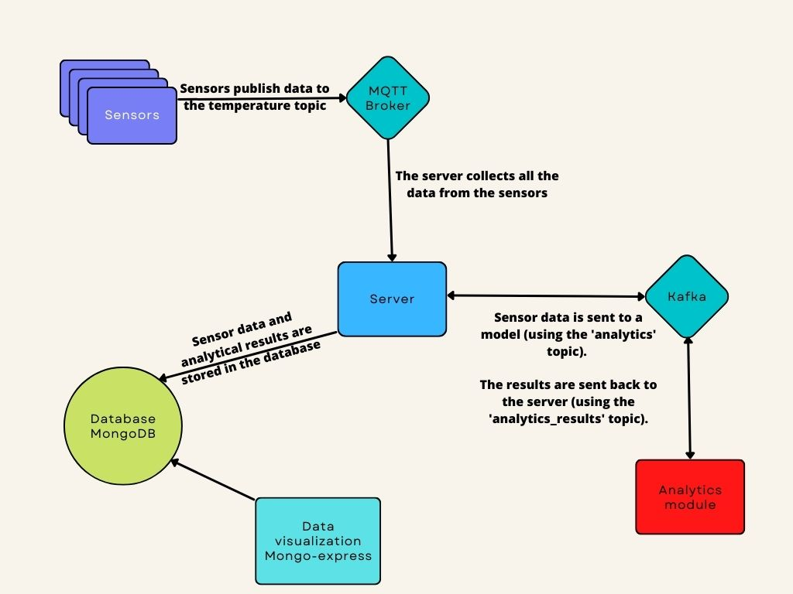

# IoT application with docker containers

## Authors
1. Marc Vivas Baiges

## Table of Contents
1. [Authors](#authors)
2. [Introduction](#introduction)
3. [How to run the application](#how-to-run-the-application)
4. [Description of each component](#description-of-each-component)

## Introduction
This project consists of the creation of an IoT application.  

  
  
> Note 1: The sensors will be simulated using docker containers.  
> Note 2: More information about the project in `./statement.pdf`.
## How to run the application

First, you have to go to the folder where the `docker-compose.yml` file is located.  

Once there, you can execute the next command to run the application.

```
docker compose up --scale sensor=1
```

> Note: The number of sensors can be changed by increasing the number of the command. (sensor=2, sensor=3 ...)  

You will have to wait for all the containers to be up and running, this takes a bit of time.  
To know if the application is running, you should see messages like this in the terminal:
```
project-sensor-4            | Sensor 44b4f68f5c2e has now sent a message to the server!
project-server-1            | Server: Message received from sensor 44b4f68f5c2e
project-server-1            | The server has now sent data from the sensor 44b4f68f5c2e to the analytics module!
project-analytics_module-1  | ------------- Analytics module -------------
project-analytics_module-1  | Message received!
project-analytics_module-1  | ConsumerRecord(topic='analytics', partition=0, offset=35, timestamp=1669453778454, timestamp_type=0, key=None, value={'v': '21.0', 'ts': '2022-11-26 09:09:38', 'sensor': '44b4f68f5c2e', 'id': 1}, headers=[], checksum=None, serialized_key_size=-1, serialized_value_size=70, serialized_header_size=-1) is being processed
project-sensor-2            | Sensor a7c0968ea3f7 has now sent a message to the server!
```
If everything works well, you can open a browser and go to http://localhost:8081/db/server/ (mongo-express) to view the data that is being processed.  

## Description of each component 
